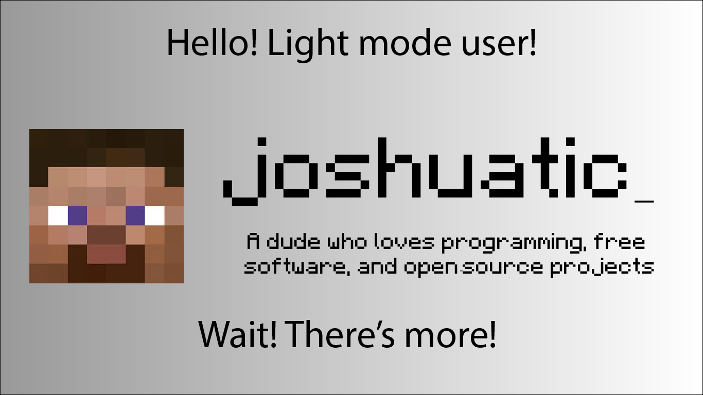

<!-- Top cards (light / dark mode) -->

  <picture>
    <source media="(prefers-color-scheme: dark)" srcset="assets/card-dark.png">
    <source media="(prefers-color-scheme: light)" srcset="assets/card-light.png">
    
  </picture>

---

## 👋 whats up, I’m joshuatic

I build programs, code, etc.
im into **Minecraft modding**, **Java/Kotlin**, **systems**, and making things go *faster than they should*.

---

## 🧠 i mess with
- minecraft mods (fabric / forge)
- java and kotlin
- tooling, REPLs, IDE stuff
- performance tuning & cursed experiments
- open source when it makes sense

---

## 📦 projects
- **Moonlight** – Luau IDE 
- **Edition Changer**: literally a side quest of mine, changes the minecraft edition title
- Random side quests that may or may not ship

---

## 🛠️ what i work with

---

## 📊 github stats

---

## 📜 license
MIT - profile to remind you, not a courtroom.
